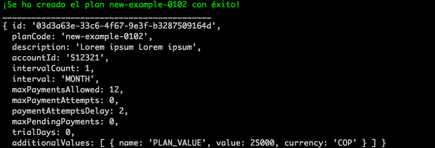

<p align="center"></p>

## CLI para crear, leer, actualizar y eliminar planes de la API de PayULatam usando Node.js

Si deseas crear nuevos planes usando la API de PayULatam, esta pequeña aplicación de línea de comandos te puede ayudar. Solo necesitas instalar [Node.js](https://nodejs.org/) y seguir las instrucciones que están a continuación:

## Instalación

``` bash
# Clonar Repositorio
git clone https://github.com/castilloedwin/cli-payu-plans.git

# Instalar Paquetes
npm install
```

## Modo de uso

``` bash
- Crear un nuevo plan
# Debemos escribir el comando node app create seguido de las siguientes opciones:

--plancode or -p # Código de tu plan (no debe tener espacios).
--description or -d # Breve descripción de tu plan
--interval or -i # El tipo de intervalo de tu plan, ya sea por días, semanas, meses o años (DAY, WEEK, MONTH, YEAR)
--intervalcount or --ic # (optional) Cantidad de intervalos, si no se especifica, por defecto será 1
--maxpaymentsallowed or -m # (optional) máximos pagos permitidos, si no se especifica, por defecto será 12
--paymentattemptsdelay or --pad # (optional) número de intentos, si no se especifica, por defecto será 2
--value or -v # El valor de tu plan
--currency or -c # Tipo de moneda
```
<p align="center"></p>